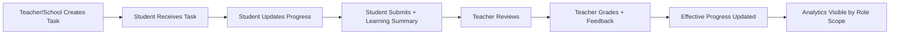
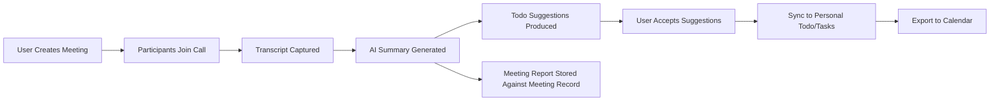
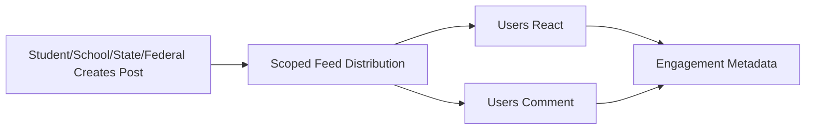
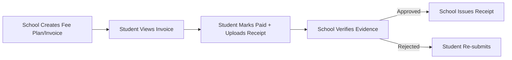
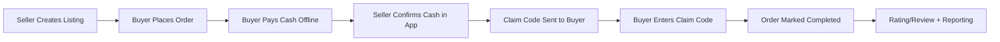
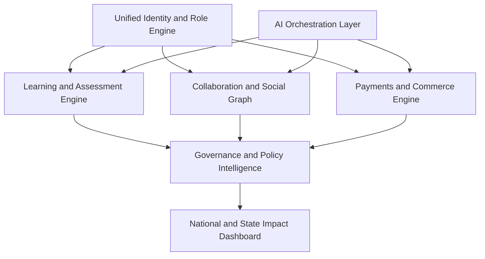

# StudyFlow Process Flow: Current State vs End Goal

Last updated: March 18, 2026

## 1. End Goal Statement

Build a one-stop platform where education, collaboration, social engagement, and trusted transactions operate in one governed ecosystem:

- student <-> student
- student <-> teacher/school
- school <-> state ministry <-> federal ministry
- learning + social + payments + commerce in a single role-safe architecture

## 2. Current Process Flows (Implemented)

## 2.1 Academic Task Lifecycle

## 2.2 Collaboration + Meeting Notes Lifecycle

## 2.3 Community Feed Lifecycle

## 2.4 School Fees Lifecycle

## 2.5 Marketplace Transaction Lifecycle

## 3. Current-to-Target Capability Matrix

| Capability | Current State | End Goal | Gap |
|---|---|---|---|
| Academic tasking and grading | Live | Fully optimized with AI-assisted pedagogy | medium |
| Multi-role governance | Live | Advanced policy analytics + intervention automation | medium |
| Chat and broadcast | Live | Real-time, high-scale channels with richer thread models | medium |
| Meetings + transcript + summary | Live (local AI pipeline) | External AI quality + enterprise recording controls | high |
| Community feed | Live baseline | Full social graph, topic channels, moderation intelligence | medium |
| Fees workflow | Live baseline | full payment rails + reconciliation dashboard | high |
| Marketplace p2p flow | Live baseline | wallet/escrow, auction, disputes, delivery workflows | high |
| Unified growth platform | Partial | one-stop education super-app | high |

## 4. End Goal Process Flow (Target)

## 5. Target Roadmap to Close Gaps

1. Complete Phase 0 architecture hardening so the current platform can absorb the next growth cycle safely.
2. Integrate external AI providers (transcription + summarization + action orchestration).
3. Add payment gateway integrations for online fee settlement and reconciliation.
4. Introduce wallet/escrow architecture for marketplace and auction bids.
5. Expand community into a media-rich channel/thread/topic model with stronger moderation tooling and photo/video upload support.
6. Build governance intelligence layer for state/federal KPI, risk alerts, and intervention workflows.

## 5.1 Active Implementation Order (Locked)

This was the last locked execution order:

1. Reliability + audit trail foundation.
2. Parent/guardian model for under-18 oversight.
3. Fees payment UX hardening from student portal entry.
4. Marketplace multi-mode payment flow + 2% platform charge accounting.
5. Trust layer expansion (disputes + seller verification signals).
6. Cross-role scorecards and operational metrics surfacing.

Each step is implemented without removing current working flows.

Execution status: completed for that cycle (March 6, 2026 baseline).

## 5.2 Next Locked Execution Order

1. Phase 0 architecture hardening and integration test expansion.
2. External AI provider integration and collaboration quality uplift.
3. Real payment rail integration and reconciliation.
4. Wallet/escrow and auction foundation.
5. Media-rich social/community expansion with photo/video upload.
6. Governance intelligence expansion.

## 6. Product Positioning (Current Truth)

StudyFlow is no longer only a student todo app.  
It is currently an education operations platform with social and transaction foundations, and a clear path to super-app status.
